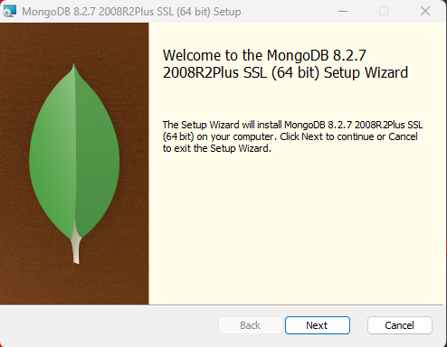
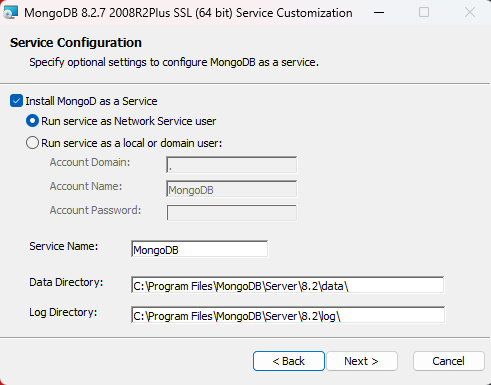
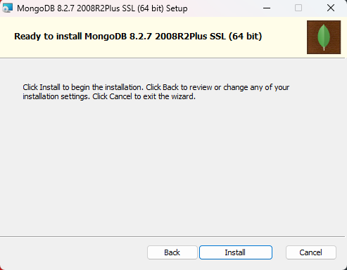
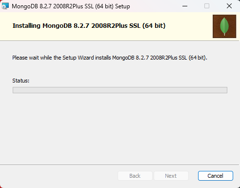
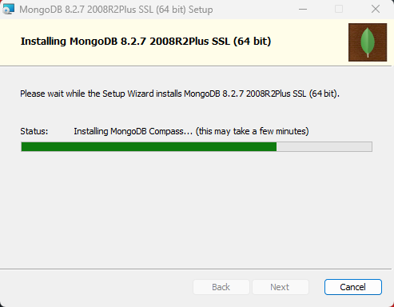
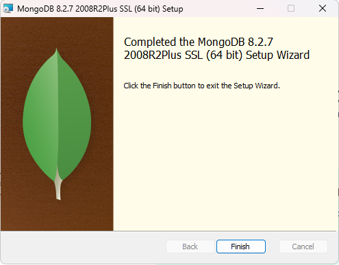
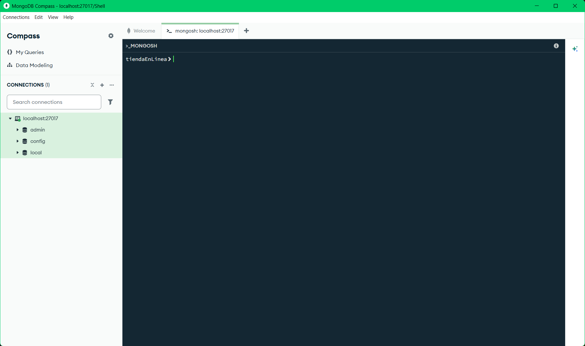

# Documentación de Instalación: MongoDB & MongoDB Compass
**Asignatura:** TI3032-u2 - Bases de Datos NoSQL  
**Integrantes:** Angelo Zamora, Alexander Cortés  
**Institución:** INACAP  

# 1. Propósito
Paso a paso de la ejecución, configuración y verificación del software MongoDB según la evidencia recolectada durante el proceso de instalación.

# 2. Paso a Paso de la Instalación (Ejecución del Setup)

* Paso  
* Acción Realizada 
* Evidencia Visual

═════════════════════════════════════════════════════╣

**01.** | Inicio del asistente de instalación. 

   

**02.** | Elección de instalación "Completa".   

   

**03.** | Definición de rutas Data y Logs. 

   

**04.** | Instalación lista para continuar.     

   

**05.** | Inicio de progreso de la instalación.       

   

**06.** | Actualizando componentes del registro.      

   

**07.** | Ejecución de instalación de binarios.

   

**08.** | Finalización del asistente.          

  

 **09.** | Ejecución y/o validación final con mongosh.        

  

**10.** | Vista consola mongosh.        

  