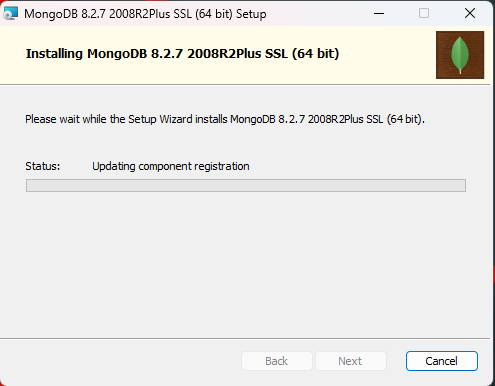
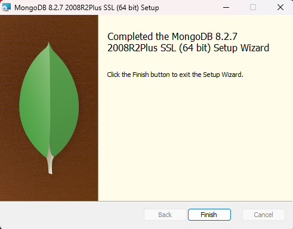
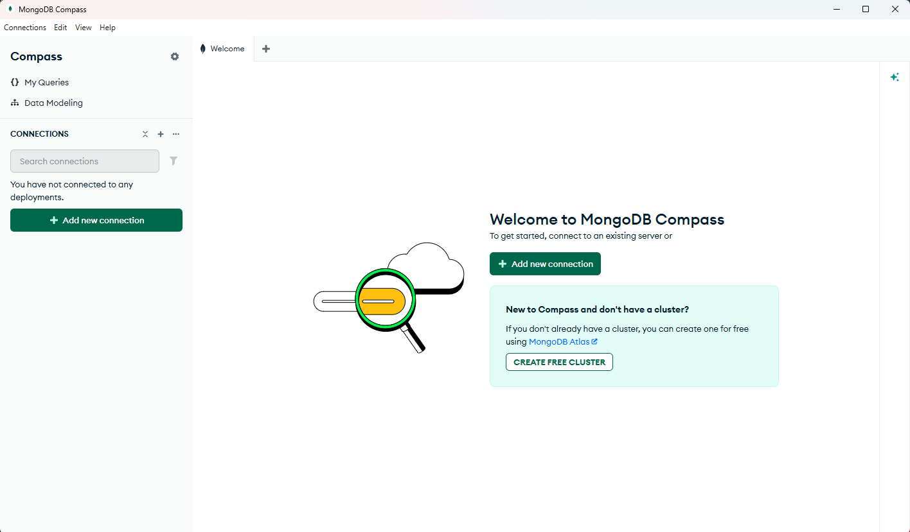

# Documentación de Instalación: MongoDB & MongoDB Compass
**Asignatura:** TI3032-u2 - Bases de Datos NoSQL  
**Integrantes:** Angelo Zamora, Alexander Cortés  
**Institución:** INACAP  

# 1. Propósito
Paso a paso de la ejecución, configuración y verificación del software MongoDB según la evidencia recolectada durante el proceso de instalación.

# 2. Paso a Paso de la Instalación (Ejecución del Setup)

| Paso  |           Acción Realizada           |      Evidencia Visual     |

**01.** | Inicio del asistente de instalación. 

   

**02.** | Aceptación de términos y licencia.   

   

**03.** | Elección de instalación "Completa".  

   

**04.** | Definición de rutas Data y Logs.     

   

**05.** | Activación de MongoDB Compass.       

   

**06.** | Confirmación antes de instalar.      

   

**07.** | Ejecución de instalación de binarios.

   

**08.** | Finalización del asistente.          

  

**09.** | Inicialización de MongoDB Compass. 

  

**10.** | Validación final con mongosh.        

  

## 3. Verificación de la Solución (Consola Integrada)
Para la ejecución de los scripts de la Unidad 2, se utilizará la **consola integrada de MongoDB Compass** (Mongoose Shell). Como se observa en la **"Pendiente a subir"**, se validó que el entorno reconoce los comandos esenciales:

1. Se abrió la terminal para asegurar que el motor está respondiendo.
2. Se ejecutó el comando: `mongosh --version`.
3. El retorno exitoso de la versión confirma que el motor está listo para recibir operaciones CRUD directamente desde la interfaz de Compass.

## 4. Conclusión
El proceso de instalación fue completado satisfactoriamente por el equipo. Se ha verificado la integridad del motor de base de datos y la operatividad de las herramientas, dejando el sistema listo para la gestión de la "Tienda en Línea".